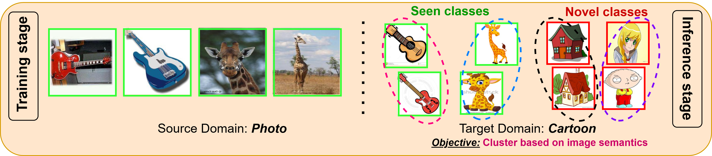

# Domain Generalized Category discovery (DGCD)
We introduce a novel paradigm of Domain Generalization in GCD (DG-GCD), where only source data is available for training, while the target domain, with a distinct data distribution, remains unseen until inference. To address this challenging setting, we introduce DG2CD-Net, a method designed to learn domain-invariant and discriminative embedding space for GCD.



- 🔗 [Paper](https://arxiv.org/abs/2503.14897)  
- 📁 [Project Page](https://shubh-nil.github.io/DG-GCD/)  
- 🖼️ [Poster](https://shubh-nil.github.io/DG-GCD/poster.html)

---

## Installation

```bash
git clone https://github.com/Shubh-Nil/D_GCD.git
cd D_GCD
```

**Environment setup**:

```bash
conda create --name dgcd python==3.12
conda activate dgcd
pip install -r requirements.txt
```

## Data Setup

Please refer to [DATASET.md](DATASET.md) for detailed instructions.

## Model training/ testing
Download the model checkpoints for your dataset of choice: 
* [**PACS**](https://example.com/weights/PACS.pkl)
* [**Office\_Home**](https://example.com/weights/Office_Home.pkl)
* [**Domain\_Net**](https://example.com/weights/DomainNet.pkl)

Navigate to the `config` directory, where you can **train** or **test** the model on different datasets and tune the hyperparameters to as per your needs:
```
cd config
```
For training - 
```
chmod +x train.sh
train.sh
```

For testing - 
```
chmod +x test.sh
test.sh
```
